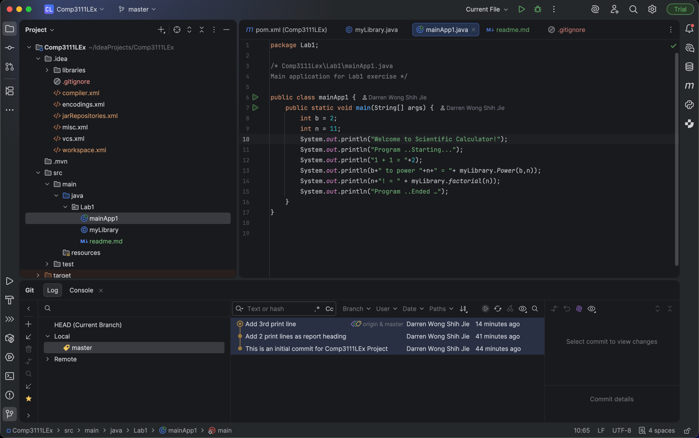

# COMP3111 Lab 1 – Git & GitHub

This Maven project `Comp3111LEx` is created for COMP3111 Lab 1 to practice using IntelliJ IDEA with Git and GitHub. 

The `Lab1` package contains:
- `myLibrary.java`: provides utility methods such as power and factorial.
- `mainApp1.java`: the main program that calls methods in `myLibrary` and prints results.

I used IntelliJ to enable Git, made at least three commits for different changes, and pushed the repository to GitHub. 

The screenshot below shows the project structure, the Java editor, and the Git log with my commits.
